# 开发者效能提升的新趋势：To-D产品线与云平台的融合

喜欢造新概念的程序员又在扩散新名字了，To-D(To Developers)，面向开发者，专注于研发提高开发者效能的产品，如jenkins，gitlab等。
在企业内部越来越重视人效的当下，降本增效成为了大家研究的方向，同时促进了To-D产品线的整合，各种大厂商也在纷纷推出自己的云平台。
但是还有相当一部分经历互联网十年浪潮洗礼的公司，很难一蹴而就全部迁移到公有云，再加上运营成本的升高，担心被云平台锁死等，近几年又有不少企业下公有云，采用混合云部署，甚至完全私有化部署也不在少数。
这样很多公司内部，自建云平台，旨在保障稳定性和可用性，并提升研发测试的效能。

好大夫发展十多年，早年的异构体系对研发的心智考验也越发的大，提供给研发使用的平台也越来越笨重。为了提升效能，好大夫技术中心历时一年，重构了整个效能云平台，目前已交付使用，接下来我们一块聊一下这一年的心路历程。

## 从工具集到平台，提效使命从未更改

咱们知道，不会偷懒的程序员，不是好的程序员。
十几年前，前辈们就在提效的道路上探索了，在那个莽荒世纪，各种工具层出不穷，各显神通，配支付，改密码，充余额，修数据齐齐上阵，是工具集爆发的大年份。

再后来随着研发、测试、运维等岗位的细化分工，工具集往平台化沉淀。迭代出了自动化测试平台，DevOPS运维平台，各种中间件的PaaS平台。再加上第三方开源平台sonar，sentry，elk体系等等，诸多场景的选择，让研发测试使用成本剧增。

为了避免研发测试抓瞎，技术中心开始整合这些平台，最初的设想是联合所有内部平台，做一个大而全的网址导航，做好文档梳理，按场景化培训研发测试使用。然后这种浅层次的整合，并未提升多少用户体验。反而往往一个场景的处理会牵扯多个平台的交互。跳来跳去，频繁的上下文切换，加重了研发测试的心智成本。

## To Die or Not to Die，这是一个永恒的话题

痛点太多，要不要改变？十几年的文化积淀和使用姿势，也许有些人早已习惯，也许有些人早已无力吐槽，也许是压死骆驼的最后一根稻草，也许是劝退新人的拦路虎。
这些痛点，仿佛沉淀在时间长河里的泥沙，需要来一次彻底的清理才能奔赴向前。

在提效的大势之下，技术中心还是下定决心，改！不改就是等死，改了也许死的更快，也许能扭转乾坤。此时如何改，又成了各个方向争论的焦点。
是延续前辈的智慧结晶，打补丁式整合，还是重新定义研发测试的使用场景，甚至重构研发测试的使用习惯。

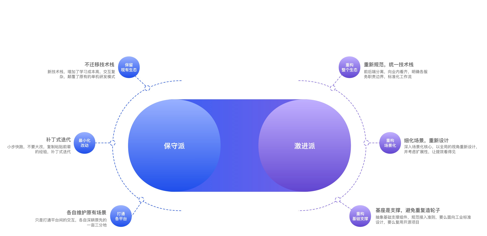

深度整合各个已经存在的平台，打破康威定律，可以想象会遇到多大的阻力。这个时候需要从更大的目标上对齐，把蛋糕做大，模糊研发、测试、运维边界。做出来的产品令人向往，才能达成共识，实现持久共赢，整个事才能往预想的方向发展。

最后在多个小组，多轮碰撞之下，随着CTO的振臂一挥，效能平台开启了重构之旅。

## 不破不立，唯有涅槃方可重生

### We have a dream

新版本的效能平台的目标：

围绕产品交付的整个生命周期展开，从研发阶段的代码到部署产线后的运营。是好大夫微服务的管家，保障服务的稳定性和可用性。是研发测试的工作台，整个产品形态需要和研发测试建连内核态连接，辅助研发测试做决策。将研发测试日常工作流式化，事件化，可视化，可量化，让提效看得见。

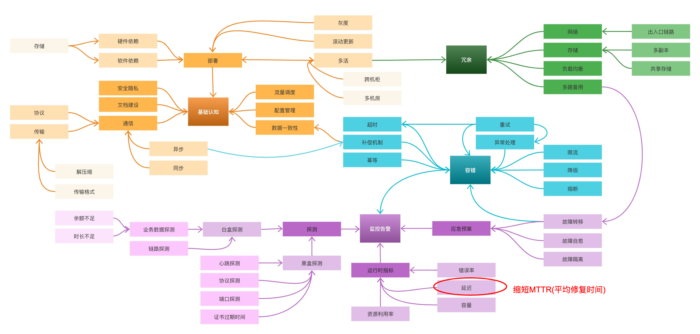
以服务运营为例，这是一个常见的场景，A服务出现接口响应慢的告警(P99波动，时延超过1000ms)，研发收到告警事件提醒后，打开我的工作台，他将看到到：

- 实时告警事件
- 历史流量同比环比
- 给出历史告警操作记录
- 给出最近该服务上线频次

研发就可以进行相应的常规操作，扩容，或限流，或调整告警阈值，抑或是回滚代码，当然部分操作还会发起工单审核。

告警处理只是产品持续交付整个生命周期的一个小环节，实时工作台，会整合了历史趋势，历史操作记录，历史上下游线上变更动作等。

根据经验，分析这些离散的事件，然后串联起来，形成一个个具象的场景，最后辅助研发测试做决策。这其实类似有监督的学习模式，随着数据的积累，学习研发操作行为，让一个个场景处理更加智能高效。

### RoadMap先行

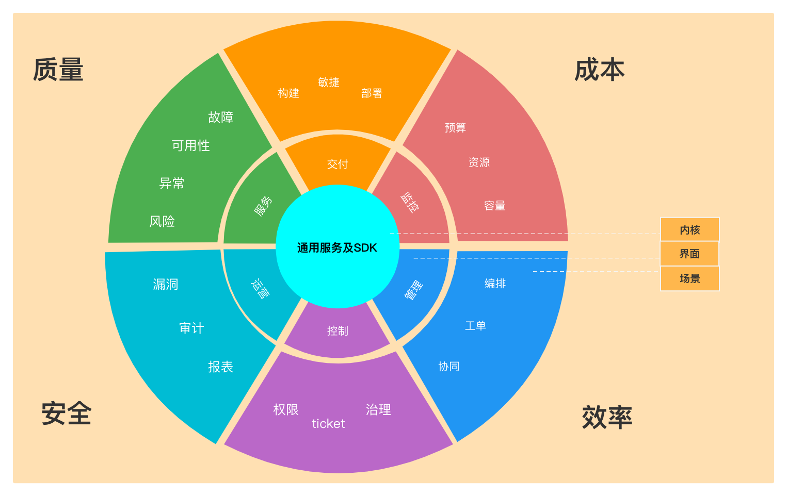
经过上面场景的分析，我们是围绕产品的持续交付展开的，涉及质量，安全，成本，效率等方方面面。咱们不可能一口吃个胖子，需要慢慢来，一份好的RoadMap，就像一盏指路明灯。
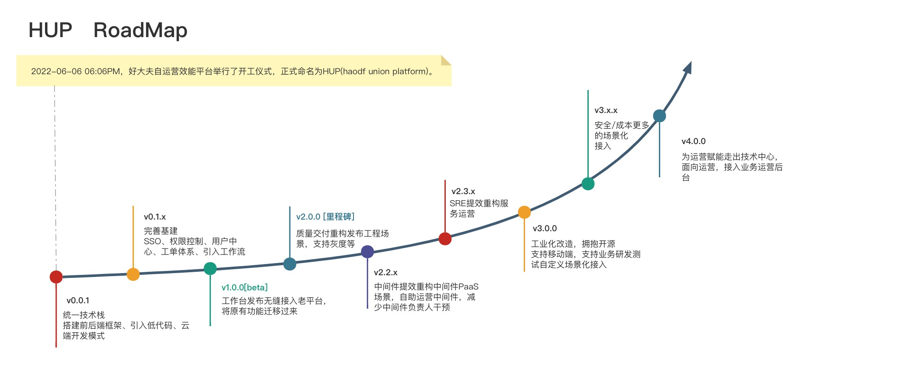

### 快速落地基建，打响HUP第一枪

为了提升信心，需要快捷完成基础组件建设。基建，决定了平台的上限，是场景化迭代的保障。
团队在一定规模之后，丰富的技术栈保障了创新性，但在团队规模较小的时候，统一技术栈的收益还是相对高点。
再加上我们经过两年的沉淀，积累了不少Golang体系的基础组件，同时为了更好地融于云原生，最终决定整个体系采用Golang架构。一起看看几个重要的基础组件。

**单点登录(SSO)**

之前各部门自研的PaaS平台，以及引入的第三方开源平台，大部分各自实现了一套用户管理模块。当有员工入职或者离职的时候，需要各个平台保障员工信息的同步，带来了额外的维护成本，以及安全风险问题。
一般解决跨平台登录，都采用SSO，实现共享用户。

SSO原理
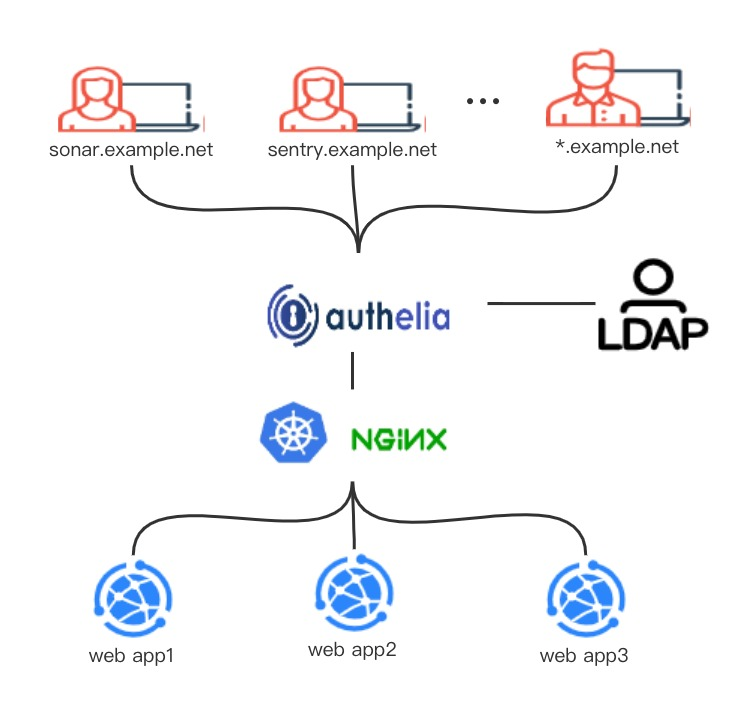

从图中可以看到，实现SSO的关键组件是Authelia，我们采用的是共享顶级域的Cookie的模式来实现SSO的。

登入，基于顶级域cookie认证，必须要保证二级域名在一个域下，即*.example.net全域互通。
这些域名都需要经过SSO认证之后才能放行，二级域名首先会判断SSO特定key的cookie是否存在，是否过期，然后携带cookie去Authelia拉取用户信息。

登出，当任意一个二级域名登出的时候，调用Authelia销毁Cookie即可。

Authelia(SSO)优势和注意事项

- 解决了跨平台频繁登录的问题。
- 对接LDAP后，方便统一管理用户，控制权限，人员离职可一键锁定全平台的权限。
- 目前主流的开源平台都适配了LDAP，Authelia也适配了大部分的开源平台，接入成本低，Authelia还支持接入OAuth体系。
- 丰富的路由访问策略，Authelia支持免认证的白名单策略，以及针对高危操作配置动态二次验证等等，支持GoogleAuth和设备生物身份认证。
- 由于实现了单点登录，带来了方便的同时，也引入了安全问题，为了避免设备被其他人操作，需要控制好cookie生命周期，失效长时间不活跃的cookie，另外关键操作需要接入动态指令的二次验证。
- 针对用户访问量大的时候，可以结合JWT使用，建设服务端认证的压力，Authelia也是支持的。

我们服务都部署在k8s中，通过简单配置ingress策略即可实现SSO。如果大家感兴趣。后续可以出一个单独的番外篇，详细介绍如何基于Authelia实现SSO。

**组织架构管理及权限控制**

组织架构如果靠人力维护会非常的繁杂，我们基于钉钉花名册的信息，动态生成一系列关联关系。
将现实中的部门与成员的关系，映射成不同场景的用户与分组的关联关系。人员的变更，自动维护整个体系信息的完整性。

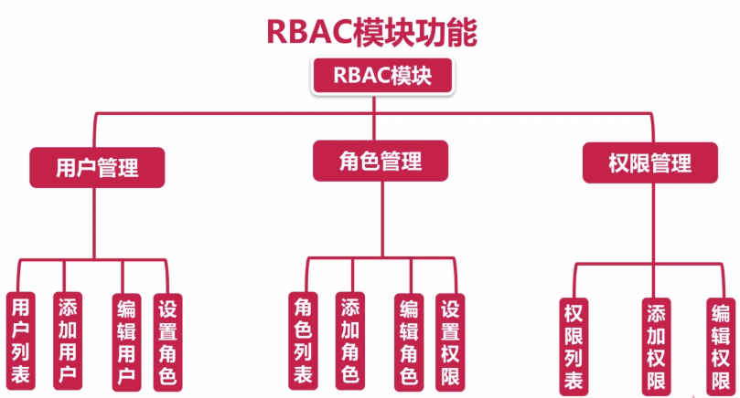

权限控制，是各个平台的基本模块， 权限的统一管理是基建的重中之重。
我们采用RBAC模式设计了权限管理，细化每一个请求的接口，并配置对应的菜单项，如一条告警规则的增，删，改，查，四个api对应四条菜单项。
权限控制精准到具体的api对应的菜单项上，api遵循restful规范，有get权限，未必有post权限。

除了api维度，还有页面维度，每个页面都配置一条路由规则，因此每个页面也对应一条菜单项，也就纳入到了权限控制中了。
根据登录用户权限的不同，会动态渲染页面，显示可操作的菜单项，如研发能看中间件运营操作，而测试能操作发布到测试环境的任务。

RBAC模式的不足

虽然我们已经按api的粒度去设计访问权限了，但有时候需要更细的粒度，需要细化到具体资源的所有者。
比如对k8s资源Pod实例操作，我们期望研发只能操作自己负责的应用实例，但RBAC模式，要么能操作所有pod，要么什么pod也操作不了。
业内也有相应的解决方案，基于属性操作。简称ABAC(Attribute-Based Access Control)，已纳入HUP后续版本迭代规划。

另外整个权限管理，菜单配置，是基于低代码实现的，后面会介绍低代码的应用。
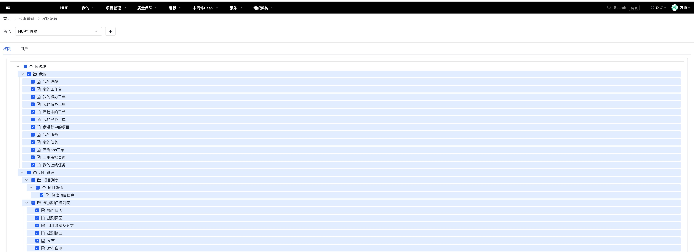

最后看一下组织架构设计的冰山一角，这也是首次尝试DDD(领域驱动设计)，去设计一个服务。
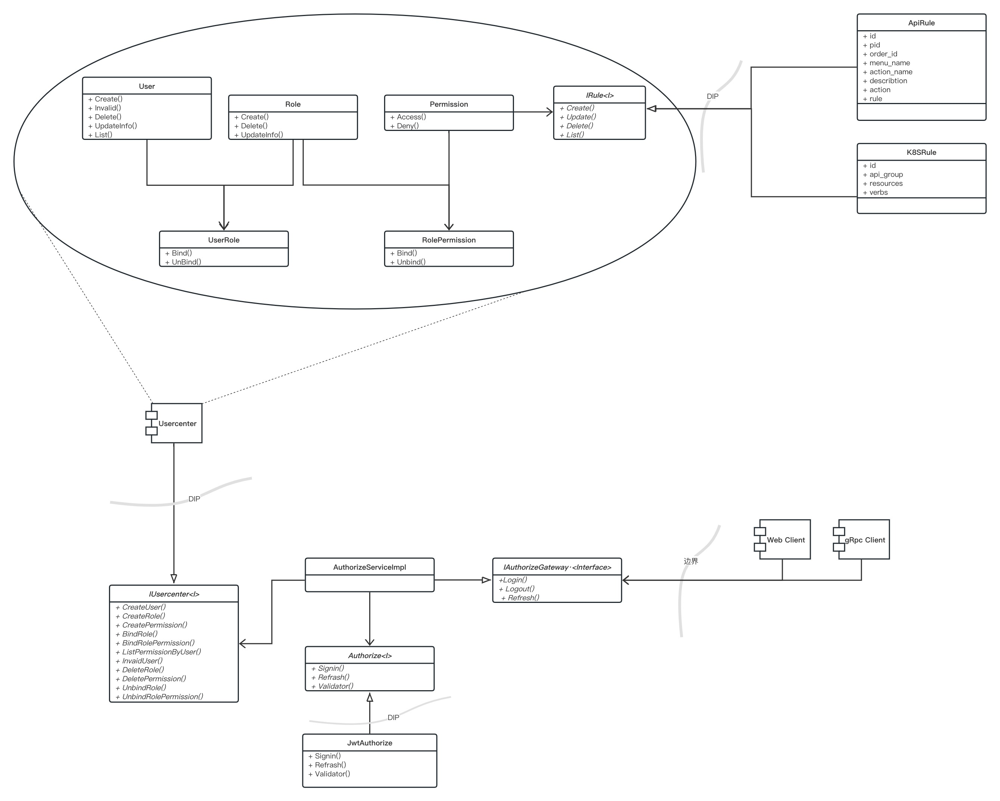

**工单体系**

做好权限控制，针对线上重要变更，就需要引入工单审核机制。工单审核，应该是一个高度抽象的模块，支持审核流的灵活配置，工单体系是场景化对接的重要基石。

工单体系需要解决以下几个问题：
- 按场景生成工单审核流，每一步审核都支持回滚到上一级，并清晰记录操作流程
- 审核环节支持动态和静态选择审核人，静态是明确审核人的情形，动态是指能主动选择合法的审核人，关键环节还可以支持加签，特殊情况还需要支持代批
- 审核人是一个抽象概念，可以是单个的人，也可以是多个人组成的小组
- 审核环节支持hook回调，可根据不同的审核行为触发不同的hook回调
- 工单审核流程，需要支持拖拽配置审核流，支持移动端审核，并联动办公交流软件，通过消息推送提醒审核人

**跨平台无缝融合**

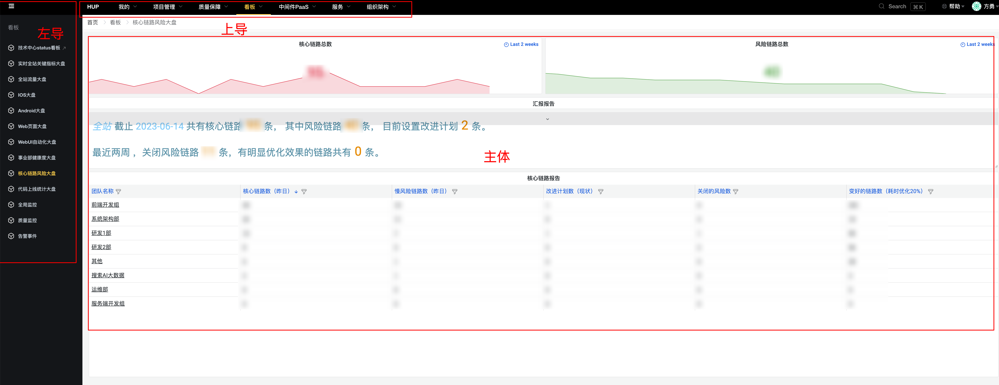

我们有很多开源的平台，如绘制看板的Grafana，记录异常调用栈的Sentry，代码质量检测的SonarQube等等，以及之前自研的内部平台。
为了避免重复造轮子，在场景化改造的时候，需要想办法复用之前的技术成果，那就涉及到跨平台交互的改造。
我们希望研发在使用HUP的时候，不要产生割裂感，不要感觉到在多个平台之间跳来跳去。
于是我们开发了一个外壳，由左导航，上导航，主体三部分组成，跨平台以主体的结构嵌入进来。
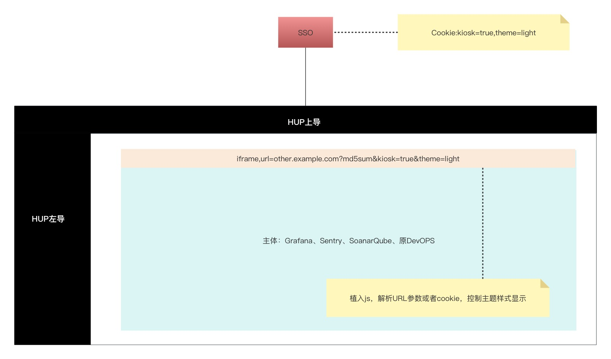
在嵌入之前，很多第三方平台有自己的登录，及导航，需要改造一下，以实现无缝嵌入。
由于我们打通了SSO单点登录，接入的平台就不需要再登录了，同时握有了登录的cookie。
我们在SSO登录的cookie里种上HUP标识，第三方平台植入一段通用js，就能随意改变样式，并适配hup主题。这样第三方平台就能完美地嵌入进来了。

这种模式主要是为了嵌入第三方开源平台，或者嵌入改造成本比较高的老平台，如果已经是前后端分离，那只用将前端整体迁入到HUP前端工程即可。

在基建的过程中，我们也做了不少创新，从架构到产品形态，涉及诸多方便，我们致力于打造令人兴奋的现代化的产品，为后续扩展到其他业务团队做先锋。

### 孵化前沿创新，提升HUP影响力

**开启云端开发**
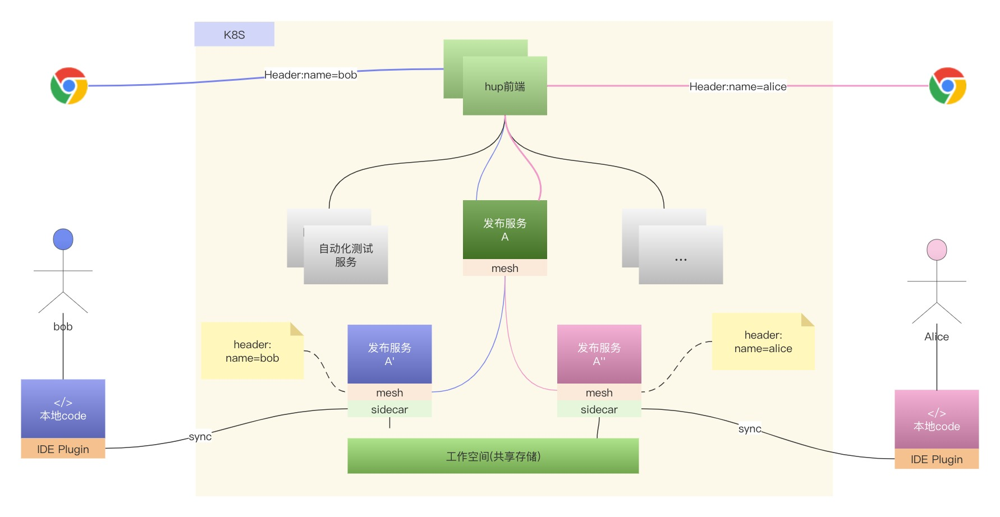
传统开发是基于本地研发调试，这比较适合单体服务，这种模式在微服务架构下会面临很多问题。
- 微服务场景下，跨服务联调，需要启动多个服务，配置复杂度高，效率低。
- 各个研发本地环境可能存在差异，如node/npm版本不一致，golang pkg源设置不一致等等环境问题，干扰问题排查。
- 有时候需要多版本对比测试，需要准备多套环境，部署和运维成本都很高。
- 有时候需要debug模式启动实例，如果实例部署在k8s里，研发操作pod成本高，有些pod基础镜像甚至不支持debug能力，如果云端能和本地一样debug就方便了。

基于以上痛点，我们需要一个统一标准的开发环境，参数配置好，debug工具也安装好，研发开箱即用。这样研发只用关心业务代码，屏蔽了环境差异，那会大大提高效率。调研后，发现Nocalhost完美地解决了我们问题。

整个流程，对研发来说几乎没有什么变化。

- 研发在本地开发，文件变更后，通过IDE Plugin同步到云端为研发分配的工作空间上。
- IDE基于kubeconfig，打通研发本地和云端的通信，云端会拉起统一标准的开发环境实例，并挂载研发云端的工作目录。云端监听文件变更，实时更新服务实例。
- 云端工作空间采用共享存储，业务代码和第三方依赖分开，业务代码目录，以研发本地机器名为标识隔离存储，第三方依赖为整个工作空间全局共享。
- 研发只用安装一个浏览器插件，修改header标识，即可将浏览器的请求劫持到云端自己的实例上，从而形成了一个闭环。

Nocalhost将研发本地开发环境迁移到了云端，并实现流量分发的形成逻辑环。Nocalhost内置了基于k8s svc模式的路由分发，但我们后端服务注册发现是基于Eureka的，只需简单扩展一下就可以了。

**尝试GitOPS**
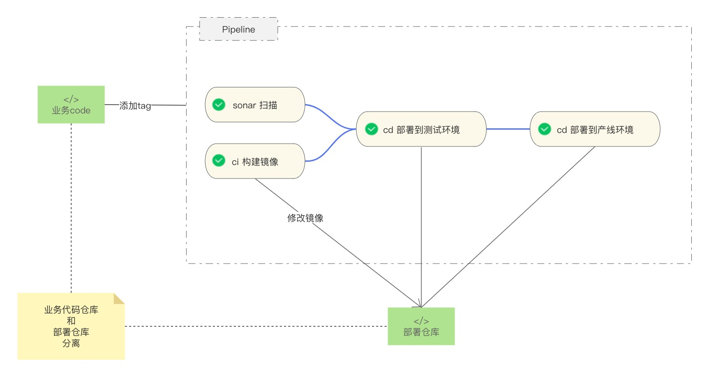

我们秉承着谁开发，谁治理的理念，hup体系从coding到运维，都是我们一手操办的。接入云端开发后，我们也把整个部署流程迁移到gitops。
业务代码和部署的配置分开，整体依托于gitlab pipeline。
业务代码测试通过后，打上版本tag，触发构建job和sonar扫描job。
镜像构建完成后，推送到harbor，同时更新部署仓库的镜像版本。
部署基于argocd，监听部署仓库代码的变更，发布到相应的k8s集群。

**看齐DDD**

基础模块，如用户中心，权限菜单管理等，属于关键支撑。
在业内也形成了领域共识，这次设计的时候也采用DDD(领域驱动设计)，同时沉淀了Golang体系的DDD框架，尝试CQRS，尝试聚合根，事件驱动等。
领域内基于事件总线EventBus通信，领域间基于gRPC通信，异步操作基于消息发布订阅。积累DDD实战经验，为后续复杂的场景化改造提供理论样例。

**尝鲜前端低代码**

HUP有很多场景提供的是管理能力，基本操作也是简单的增删改查。
比如工单审核流程，列表页用表格展示待办的工单，再加一个详情页用于展示和操作。
类似的场景还是很多，比如权限配置模块，菜单配置模块，消息管理模块等等都采用了低代码实现，方便后端研发快速搭建自己的应用。
整个低代码体系是基于百度开源项目amis实现的，如果大家感兴趣，后续会输出相关的整合文档。

### 重构高频场景，提升HUP价值

随着基建的推进，HUPv1.0.0完成了老平台的整合，但真正体现实质性价值的，还是一个个经验固化下来的场景。
受二八规律影响，这些日常场景中，高频使用的，也就那么几个，将这些高频场景优化到极致，这时候谈论效能才更有意义。

我们复盘了一下，重构发布工程，提升发布效率，并打造成标杆的场景化范例，是首选项。

重构发布工程，一年前就有过多方讨论，每次都以激烈的争论收场，得不到实质性进展。
发布工程涉及到三个小组协作，多个平台的交互。运维组研发负责发布到虚拟机，架构组研发负责发布到k8s，测试阶段还对接了测试研发的自动化测试平台，中间还穿插着项目管理。
整个发布工程，处于一种能用又不好用的状态。有时候发生点问题，需要三方协调排查，效率低。
业务研发测试，完成一次从开发到产线的发布，需要在多个平台上操作，严重影响了效率。
再加上整个发布工程，经历了十多年的积淀，一直在上面打补丁，很多逻辑异常的复杂，已经成为对维护人员的心智负担。

发布工程需要优化，但如何优化一直无法达成共识，有小改方案，又重构方案。其实这种项目改造属于，少做少错，多做多错，不做不错，很容易形成分歧。

这个时候自上而下的领导力就尤为关键，跨部门协作，需要以更高的维度对齐目标，将项目做大，就会产生虹吸现象，蛋糕大了，就会吸引大家主动参入进来。
在CTO的号召下，重构发布工程正式启动。这个项目，涉及前端团队，运维团队，测试研发团队，系统架构团队多部门协作，为了保障质量和沟通效率，我们封闭开发了一个多月。
整个发布工程。各个环节涉及的细节非常多，再上使用习惯的转变，刚开始试用那两周，是被吐槽最惨的时期。随着使用文档的丰富，以及宣讲，大家开始逐级适应新的发布体系。
简单聊一下，改造后的发布工程。

简单介绍一下《SRE:google运维解密》的发布工程哲学：
- 自服务类型，业务团队能自给自足，自己控制发布流程，同时需要高度自动化，研发只用很少的干预。
- 追求速度，敏捷开发模式，需要频繁构建，测完即能随时发布。
- 密闭性，也就是构建的幂等性，不论何时何地，构建结果应该都相同。
- 强调策略和流程，需要保障每次上线的版本，严格进行了CodeReview，都被测试验证过。

接下来一起看一下。重构后的发布工程具备了哪些特性：
- 不漏上不错上

一般发布只考虑代码变更的维度。
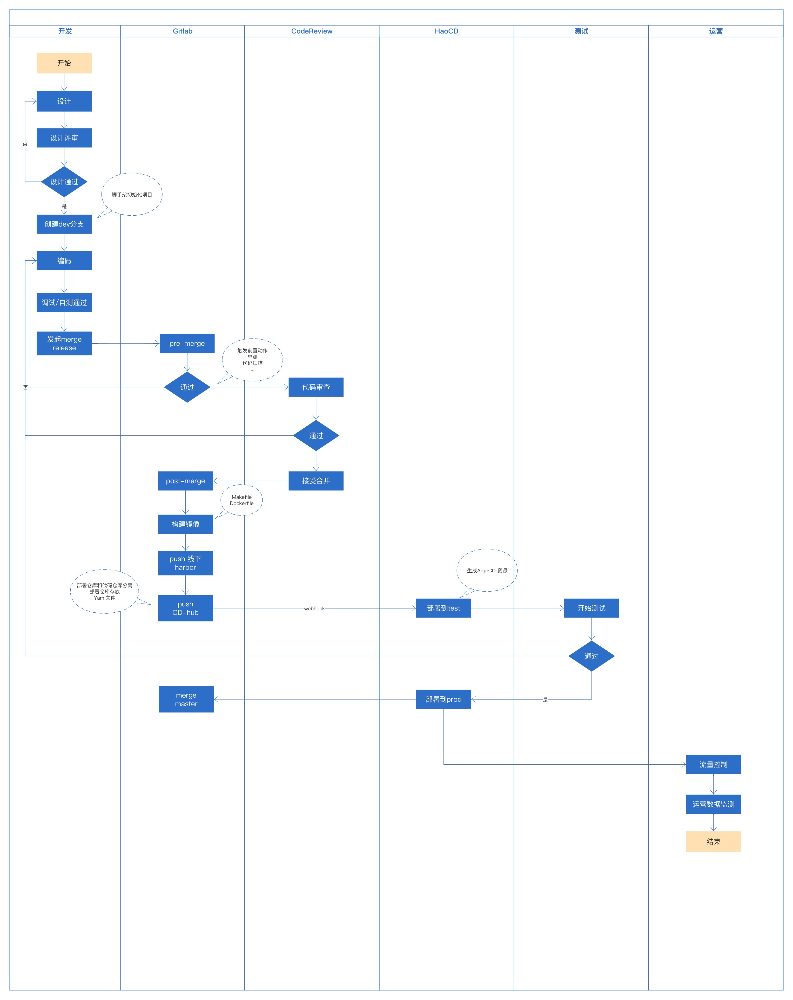

其实发布不只有代码，配置变更，线上运营操作等，都属于发布范畴。而这些操作，需要被记录跟踪到，在需要的时候，支持在开发环境，测试环境，和产线环境重现整个流程。
改版的后的发布工程，将Code变更，Apollo配置，RabbitMQ配置，短信模板配置，脚本执行等等都纳入发布流程中。

- 引入了工作流，将发布流程标准化、流程化，各个步骤支持可插拔

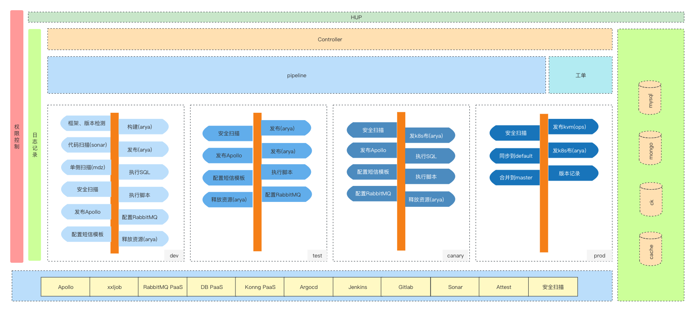

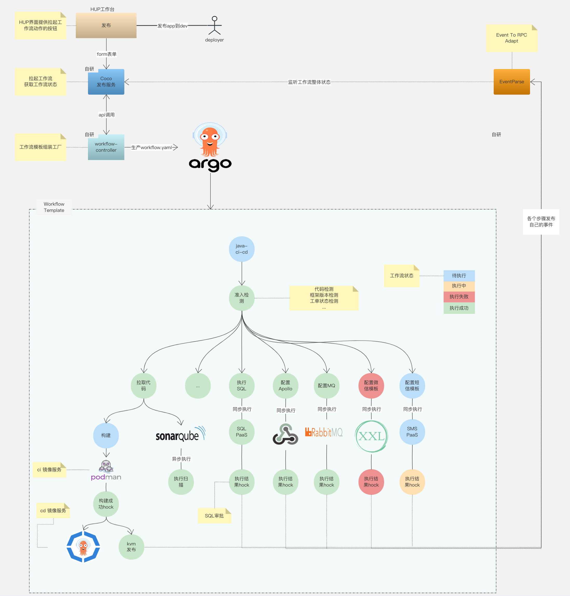

这部分挑战也是最大的，不仅需要和第三方开源平台做交互，还需要支持各个环节的热插拔。
为了将第三方开源服务接入到hup，我们开发了胶水层，封装成api。特殊的第三方平台，直接采用嵌入的方式集成进来。
为了支持可插拔，我们研发了workflow-controller用于组装工作流，为了减少耦合，研发了事件解释器EventBus，用于处理工作流中的hook回调。
工作流依托于开源项目，argo workflow，podman，argocd等。
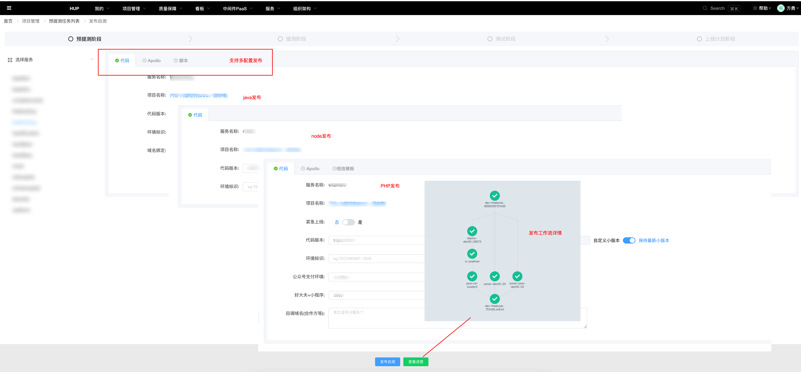

发布工程中采用模块化分解各个步骤，方便可插拔，也方便了职责分离，同时发布工程，支持多集群并行发布，支持幂等。线上有三套隔离的多活集群，一套虚拟机，两套k8s。

- 服务编排和配置编排
虽然我们鼓励业务敏捷开发，随时测完随时上线，不要有依赖，但这会增加研发向下兼容的成本。
有些时候，项目迭代涉及多个服务，需要集成到一起统一发布。因此发布工程，即需要支持业务自己独立发布，还需要支持服务编排发布的能力。
针对集成发布，我们限制于晚上特定时间发布，按南北向流量分层发布，首先发布不依赖代码的sql，apollo配置，mq配置，然后发布后端服务，再发布前端服务，最后发布脚本，同步Kong配置。

- 多版本发布，及灰度发布支持

为了适配多版本发布，我们实现了一个流量分发的逻辑环，需要适配流量入口有，http入口流量，mq消息入口流量，以及脚本入口流量。
这里给出的mq流量多版本示意。
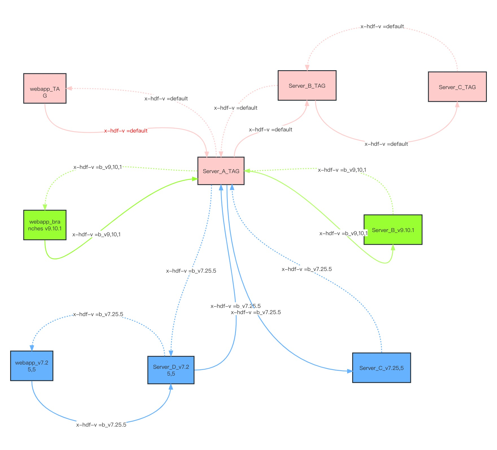
截止目前为止灰度发布还是研发期，这里给出一个流程示意图。

经过几个版本的迭代，发布工程也逐渐接近毕业版本，为后续其他场景化的对接提供了可以参考的模板。
篇幅有限，这里就不展开细说，当然大家感兴趣，后续可以出了一个番外篇详细聊一下发布工程。

### 超越技术范畴，传承HUP薪火

技术从来只是基石，持续发展，受影响因素很多，往往离成功也许只差一点点运气。静下心来，慢慢打磨，有时候做着做着，也许就水到渠成了。

**效能，需要一杆称**

场景化迭代，不只是功能实现，既要考虑用户使用体验，还需要考虑交付的产品质量，标准化流程，往往会牺牲一部分效率。

拿发布工程为例，服务上线必须经历开发环境，测试环境，甚至是灰度环境，最终才能全量发布到产线。
早些时候，开发是能跳过所有环节，不用测试，直接发布到产线的，规范上线流程后，会延长上线时长，但为了交付质量，需要做平衡。
像这样的场景还是挺多的，研发测试有自己的诉求，但平台亦背负着自己的使命，需要不断地调整，寻找平衡点，而这是一个长期的过程，也是目前吐槽最多的地方。

**碰撞，真正的幕后推手**

好产品是碰撞出来的，不是被设计出来的，需要多方不断讨论，不断吐槽，一版版的迭代。HUP是研发测试的工作台，是好大夫服务的管家，涵盖服务的整个生命周期，从仓库代码到产线运行，以及服务治理。
这是一个庞大的体系，很难穷举所有场景，很难以上帝的视角提前设计好各个环节。我们尽量做到扩展友好，将日常工作事件化，抽象成不同场景的工作流，配合工作流的钩子，动态调配日常工作，直到固化成一条工作经验。
在这个过程中，需要放低姿态，去倾听研发测试的心声，千万不能闭门造车，否则很多功能的实现就变成了花架子，变成了自嗨的玩具。

**MDD，让提效看得见**

为了避免黑盒，我们借助于MDD思想(Metrics-Driven Development)，要求各个组件提炼出健康指标和反映内在价值的指标，同时细化各个场景的指标。
统计分析各个环节的耗时，失败率，使用频率等，为持续迭代场景提供数据支撑。
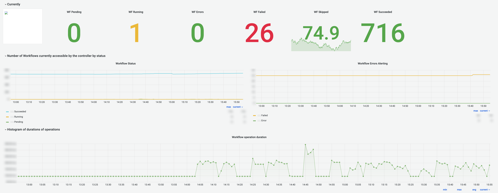

**文化自信，持续发展之道**

随着HUP一期期的迭代，伴随着大家的吐槽，伴随着大家的期许，HUP快速成长着。
作为HUP平台的研发的我们，也逐渐自觉了新的身份认同--HUPer，沉淀了番号--Thinking In SRE.

HUPer做的不只是提升效能的平台，而是在做一种企业文化，将效能、SRE等理念同步给更多的人。
我们知道产品交付，发布产线不是终点，而这恰恰只是开始，HUP作为研发测试工作台入口，势必承载了服务运营的职责，保障全站可用性和稳定性，即是职责，亦是使命。
HUP作为一种文化符号，在不知不觉中更新大家的认知，同时吸纳更多的人共建生态。HUPer们也在不断布道，组建线下沙龙，宣讲SRE等理念。

每一期的HUP版本迭代我们都会取一个代号，并召开发布会，发放周边礼品，印有logo的文化衫，办公文具，书签等等。
这是一种文化氛围，是一种文化传承，也是历史的见证。

## Keep Running, Keep Thinking
提效是一个长期的过程，道阻且长，重构发布工程只是开端，我们还需要重新梳理SRE整个治理体系，缩短MTTR(故障排查时长)，保障稳定性和可用性。
目前HUP是基于私有云场景展开的，后续也会考虑探索公有云和边缘计算的领域，为开源社区贡献一份自己的力量。